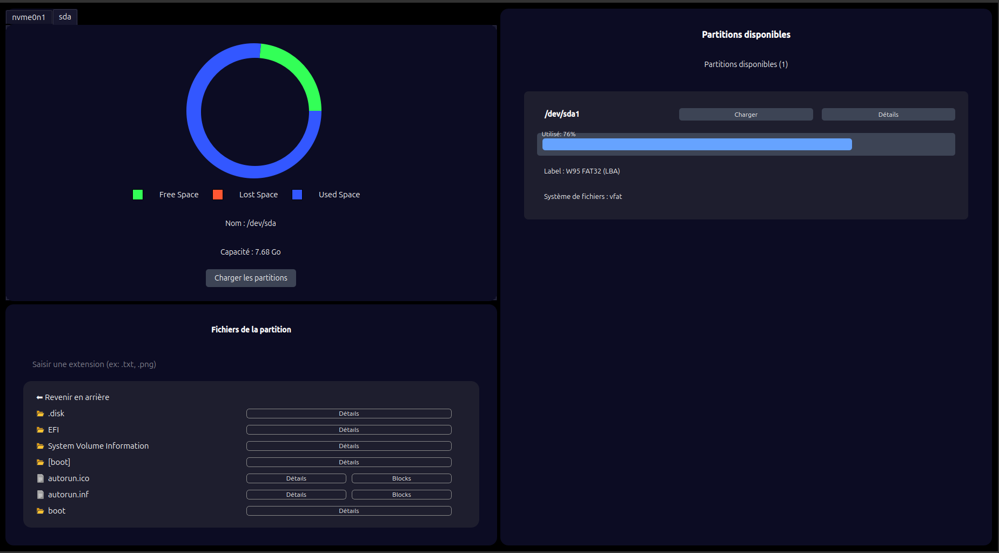

# Preview of the Project

This project includes a video demonstration available in the [`video-demo/`](./video-demo/) folder. Check it out to see the key features in action.

---

### Image of a disk showing a dual boot configuration.


---


### Image of a USB drive.



---


### Details of a specific partition.


---


### Details of a specific file.


---


### Blocks of a given file.


---


### Example of a search filter.


---


# Disk API

## Overview
This API allows you to retrieve information about disks, partitions, and files on the current machine. It communicates over HTTP or HTTPS and provides responses in JSON format.

## Prerequisites

### Installing Go on Linux

You can install the latest version of Go (Golang) using the official tarball:

```bash
cd /tmp

# Download the latest Go tarball (check https://go.dev/dl/ for newer versions)
wget https://go.dev/dl/go1.22.0.linux-amd64.tar.gz

# Remove any existing Go installation
sudo rm -rf /usr/local/go

# Extract the archive to /usr/local
sudo tar -C /usr/local -xzf go1.22.0.linux-amd64.tar.gz

# Add Go to your PATH (permanent setup)
echo 'export PATH=$PATH:/usr/local/go/bin' >> ~/.bashrc
source ~/.bashrc # or .zshrc if you use zsh
```

## How to Run the Server
To start the API server, navigate to the `src` directory and run the following command:
```sh
sudo go run api.go disk.go file.go partition.go utils.go filter.go block.go
```
If Go is installed but the command is not found when using `sudo`, try running:
```sh
su
go run api.go disk.go file.go partition.go utils.go filter.go block.go
```

By default, the server listens on **port 8080**.

## API Endpoints

### 1. Get Available Disks
**Endpoint:**
```sh
GET http://localhost:8080/disks
```
You can request this endpoint using a browser, `curl`, or the graphical interface buttons.

**Response Example:**
```json
[
  {"name": "/dev/nvme0n1", "capacity_gb": 476.94}
]
```
This response provides a list of detected disks on the machine.

---

### 2. Get Partitions for a Specific Disk
**Endpoint:**
```sh
GET http://localhost:8080/partitions?disk=XX
```
Replace `XX` with the name of an accessible disk, e.g., `/dev/nvme0n1`.

This request returns all partitions found on the specified disk along with relevant details.

---

### 3. Get Files in a Specific Partition
**Endpoint:**
```sh
GET http://localhost:8080/files?partition=XX&path=YY
```
- `XX` is a **mounted partition**, e.g., `/dev/nvme0n1p6` or `/dev/sda1`
- `YY` (optional) is a **valid path** starting from the root of the specified partition to the folder you want to list

This request returns all files and directories within the specified path along with their details.

---

### 4. Filter Files in a Specific Partition
**Endpoint:**
```sh
GET http://localhost:8080/files?partition=XX&path=YY&filter=ZZ
```

- `XX` is a **mounted partition**, e.g., `/dev/nvme0n1p6` or `/dev/sda1`
- `YY` (optional) is a **valid path** starting from the root of the specified partition to the folder you want to list
- `ZZ` is a keyword used to filter file names, e.g., `Documents` or `.png` for a file extension

**Example:**
```
http://localhost:8080/files?partition=/dev/nvme0n1p7&path=iusearchbtw/test&filter=.png
```

In this example, we search for PNG files in the `iusearchbtw/test/` folder within the `nvme0n1p7` partition.

### 5. Get Blocks of a Specific File
**Endpoint:**
```sh
GET http://localhost:8080/blocks?partition=XX&path=YY
```

- `XX` is a **mounted partition**, e.g., `/dev/nvme0n1p6` or `/dev/sda1`
- `YY` is a **valid path** starting from the root of the specified partition to the file you want to retrieve its blocks.

**Example:**
```
http://localhost:8080/blocks?partition=/dev/nvme0n1p3&path=kalash/Mes_documents/League_of_Legends/Replays/EUW1-6980909258.rofl
```

In this example, we get the blocks of the file located at : `kalash/Mes_documents/League_of_Legends/Replays/EUW1-6980909258.rofl` folder within the mounted partition /dev/nvme0n1p3.

---

## Error Handling
In case of an error, the API returns a JSON response with an `error` key.

**Example Error Response:**
```json
{"error": "No partition found for disk /dev/nvme0n2"}
```
This ensures that errors are properly communicated to the user.

## Notes
- Ensure the API server is running before making requests.
- If you connect an external disk or USB drive and the file system is not accessible, try unplugging and reconnecting the device.
- The `filter` and `path` parameters are optional. By default, no filter is applied, and the path defaults to the root directory of the partition.


# Python Client Setup Guide

## Prerequisites

Before running the Python client, ensure you have the required dependencies installed.

### Install PyQt6

The GUI requires the PyQt6 module. Install it using:
```sh
pip install PyQt6
```

## Running the Python Client

Navigate to the project folder:
```sh
cd projet_2a/GUI
```

### Important Warning

Before launching the GUI, ensure the Go server is running. Start the server first, then proceed with the Python client.

### Launch the GUI

Run the following command:
```sh
python3 -m DiskAnalysisUI
```

This will start the graphical user interface of the Python client.

---

# Documentation

You can find detailed documentation, in the `doc/` folder.

- [doc.pdf](doc/doc.pdf) – Main document (PDF format)
- [doc.tex](doc/doc.tex) – LaTeX source file

---

# License

This project is licensed under the terms of the LICENSE file included in this repository.  
Please refer to the [LICENSE](LICENSE) file for more details.


